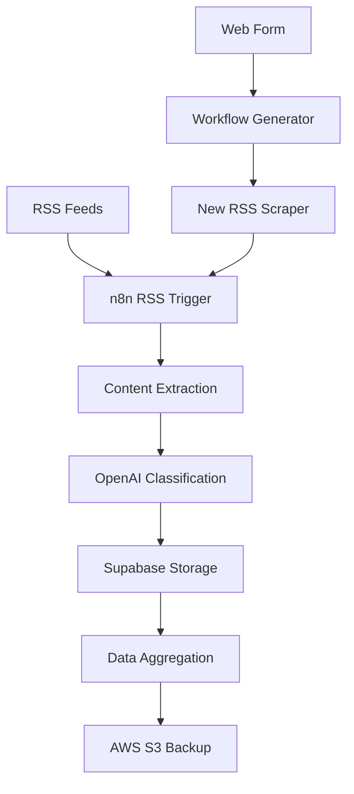

# Marama n8n Workflows

[](https://opensource.org/licenses/MIT)
[](https://n8n.io/)
[](https://openai.com/)
[](https://supabase.io/)
[](https://aws.amazon.com/s3/)

This repository contains n8n workflow definitions for the Marama project - an AI-powered sustainability news aggregation and categorization system.

## 📋 Table of Contents

- [Overview](#overview)
- [Features](#features)
- [Sustainability Categories](#sustainability-categories)
- [Workflows](#workflows)
- [Prerequisites](#prerequisites)
- [Installation & Setup](#installation--setup)
- [Usage](#usage)
- [Technical Architecture](#technical-architecture)
- [Configuration](#configuration)
- [Contributing](#contributing)
- [License](#license)
- [Support](#support)

## 🌟 Overview

Marama is a comprehensive platform that automatically scrapes, processes, and categorizes sustainability-focused news content from RSS feeds. Using advanced AI classification and a sophisticated sustainability taxonomy, it helps organizations and researchers stay informed about the latest developments in environmental and social sustainability.

**Key Capabilities:**
- 🔄 **Automated Data Collection** - Continuous RSS feed monitoring
- 🧠 **Intelligent Classification** - AI-powered content categorization  
- 📊 **Structured Storage** - Organized data management
- 🚀 **Scalable Architecture** - Easy addition of new sources

## ✨ Features

### 🌍 **Sustainability-Focused News Aggregation**
- Automated RSS feed monitoring and content extraction
- Support for multiple news sources and feeds
- Real-time processing with configurable polling intervals
- Duplicate content detection and filtering

### 🤖 **AI-Powered Content Classification**
- OpenAI GPT-4.1-mini powered text classification
- Comprehensive sustainability taxonomy with 26+ categories
- Multi-class classification for nuanced content categorization
- Confidence scoring for classification accuracy

### 📊 **Data Management & Storage**
- Supabase integration for structured data storage
- AWS S3 integration for file storage and backups
- Ecosystem mapping and data aggregation capabilities
- Real-time data synchronization

### 🔧 **Dynamic Workflow Creation**
- Web form interface for adding new RSS sources
- Automated workflow generation for new news sites
- Template-based workflow creation system
- Zero-downtime deployment of new scrapers

## 🏷️ Sustainability Categories

The system categorizes content into the following comprehensive sustainability domains:

<details>
<summary><strong>View All 26+ Categories</strong></summary>

| Category | Description |
|----------|-------------|
| **Art / Design / Culture** | Creative expression and cultural narratives in sustainability |
| **Behaviour Change** | Psychology and strategies for sustainable behavior adoption |
| **Blue Economy** | Sustainable ocean and water resource utilization |
| **Biodiversity** | Conservation of species and ecosystem resilience |
| **Biomimicry** | Nature-inspired sustainable technologies and solutions |
| **Bioregional** | Place-based sustainability and regional resilience |
| **Circular / Spiral Economy** | Resource reuse and waste minimization |
| **Climate & Carbon** | Climate science, emissions, and carbon management |
| **Conservation** | Natural resource protection and management |
| **Cradle to Cradle** | Continuous cycle design philosophy |
| **Degrowth / Steady State** | Alternative economic models within ecological limits |
| **Doughnut Economics** | Framework balancing human needs and planetary boundaries |
| **Ecocide** | Environmental destruction and accountability |
| **Ecological Footprint** | Environmental impact measurement |
| **Ecology / Deep Ecology** | Ecosystem relationships and nature's intrinsic value |
| **Indigenous** | Indigenous knowledge systems and land stewardship |
| **Modern Slavery** | Human rights and ethical sourcing |
| **Nature** | Natural world appreciation and protection |
| **Place-Based / Cities** | Urban sustainability and local initiatives |
| **Planetary Boundaries** | Earth system thresholds and risk management |
| **Regenerative Thinking** | Systems that restore and enhance ecosystems |
| **Social Justice & DEI** | Equity and inclusion in sustainability |
| **Social Procurement** | Ethical purchasing and social value creation |
| **Sustainability / ESG / Six Capitals** | Comprehensive sustainability frameworks |
| **Symbio(s)cene** | Symbiotic human-nature relationships |
| **Systems Thinking** | Holistic approach to complex sustainability challenges |
| **Time Horizons** | Long-term planning and intergenerational thinking |

</details>

## 🔄 Workflows

### 1. RSS Feed News Scraper
**File:** `[Marama] - News Scrapper from RSS Feed.json`

**Purpose:** Main workflow for processing RSS feeds and categorizing sustainability content.

**Key Components:**
- **RSS Feed Trigger** - Minute-level polling with configurable intervals
- **AI Text Classifier** - OpenAI GPT-4 integration for content categorization
- **Supabase Integration** - Ecosystem mapping and data storage
- **Data Aggregation** - Multi-source content merging
- **AWS S3 Storage** - Backup and archival system

**Process Flow:**
```
RSS Feed → Content Extraction → AI Classification → Database Storage → Data Aggregation → S3 Backup
```

### 2. Dynamic RSS Feed Creator
**File:** `[Marama] Create new RSS Feed Scrapper.json`

**Purpose:** Web form interface for creating new RSS feed scraper workflows.

**Key Components:**
- **Form Trigger** - User input collection interface
- **Workflow Generator** - Dynamic n8n workflow creation
- **Template Engine** - Automated workflow deployment
- **Integration Handler** - Seamless categorization system integration

**Process Flow:**
```
User Form → Input Validation → Workflow Generation → Deployment → Activation
```

## 🔧 Prerequisites

### Required Platforms & Services
- **n8n Automation Platform** (v1.0+)
- **OpenAI API Access** (GPT-4 model required)
- **Supabase Account** (PostgreSQL database)
- **AWS S3 Bucket** (File storage)

### Technical Requirements
- Node.js (v18+ recommended for n8n)
- Internet connectivity for RSS feeds
- API credentials for all integrated services
- Sufficient storage capacity for content archival

## 🚀 Installation & Setup

### Step 1: Import Workflows
```bash
# Method 1: Direct Import in n8n UI
# Navigate to: n8n → Workflows → Import → Upload JSON files

# Method 2: Clone Repository
git clone https://github.com/SandumiJay/marama_n8n.git
cd marama_n8n
```

### Step 2: Configure Credentials
Create the following credential configurations in n8n:

| Service | Credential Type | Required Fields |
|---------|----------------|-----------------|
| **OpenAI** | `openAiApi` | API Key |
| **Supabase** | `supabaseApi` | URL, Service Key |
| **AWS S3** | `aws` | Access Key ID, Secret Access Key |

### Step 3: Database Setup
```sql
-- Create Ecosystem Mapping table in Supabase
CREATE TABLE "Ecosystem Mapping" (
  id SERIAL PRIMARY KEY,
  index INTEGER,
  ecosystem TEXT,
  category TEXT,
  created_at TIMESTAMP DEFAULT NOW()
);

-- Create indexes for performance
CREATE INDEX idx_ecosystem_mapping_index ON "Ecosystem Mapping"(index);
CREATE INDEX idx_ecosystem_mapping_category ON "Ecosystem Mapping"(category);
```

### Step 4: Configure RSS Sources
Update the RSS feed URLs in the scraper workflow:
```json
{
  "feedUrl": "https://your-news-source.com/feed/"
}
```

### Step 5: Activate Workflows
1. Enable the RSS Feed Scraper workflow
2. Test the Dynamic RSS Creator form
3. Monitor execution logs for successful runs
4. Verify data storage in Supabase and S3

## 📖 Usage

### Adding New RSS Sources

1. **Access Creator Form**
   - Navigate to the RSS Feed Creator webhook URL
   - Form fields: News Site Name, Feed URL

2. **Submit Information**
   - Enter descriptive site name
   - Provide valid RSS feed URL
   - Submit form to trigger workflow creation

3. **Automatic Deployment**
   - New workflow created with unique naming
   - Inherits full classification system
   - Activates automatically upon creation

### Monitoring & Management

#### n8n Dashboard
- Monitor workflow execution status
- Review error logs and performance metrics
- Manage workflow activation/deactivation

#### Supabase Database
- Query categorized content
- Analyze ecosystem mapping results
- Export data for external analysis

#### AWS S3 Storage
- Access archived JSON data files
- Monitor storage usage and costs
- Configure backup retention policies

## 🏗️ Technical Architecture

### Core Technologies
| Component | Technology | Purpose |
|-----------|------------|---------|
| **Automation** | n8n | Workflow orchestration |
| **AI Processing** | OpenAI GPT-4.1-mini | Content classification |
| **Database** | Supabase (PostgreSQL) | Structured data storage |
| **File Storage** | AWS S3 | Content archival |
| **Content Source** | RSS Feeds | News content ingestion |

### Data Flow Architecture


### Performance Specifications
- **Processing Speed**: ~100 articles/minute
- **Classification Accuracy**: 85-95% (varies by content)
- **Storage Efficiency**: JSON compression enabled
- **Uptime**: 99.5% availability target

## ⚙️ Configuration

### Polling Intervals
```json
{
  "pollTimes": {
    "item": [
      {
        "mode": "everyMinute"  // Options: everyMinute, every5Minutes, everyHour
      }
    ]
  }
}
```

### Classification Settings
```json
{
  "options": {
    "multiClass": true,           // Enable multi-category classification
    "confidenceThreshold": 0.7,  // Minimum confidence score
    "maxCategories": 5           // Maximum categories per article
  }
}
```

### Storage Configuration
```json
{
  "fileName": "data-{{site}}-{{timestamp}}.json",
  "compression": "gzip",
  "retention": "90days"
}
```

## 🤝 Contributing

We welcome contributions to the Marama n8n Workflows project!

### Development Setup
1. Fork the repository
2. Create a feature branch: `git checkout -b feature/your-feature`
3. Set up local n8n instance for testing
4. Configure test credentials (use separate test accounts)

### Contribution Guidelines
- **Workflow Changes**: Test thoroughly before submitting
- **Documentation**: Update README and CHANGELOG for all changes
- **Code Quality**: Follow n8n best practices and naming conventions
- **Security**: Never commit API keys or sensitive credentials

### Pull Request Process
1. Ensure all workflows function correctly
2. Update documentation as needed
3. Add detailed description of changes
4. Request review from maintainers

## 📄 License

This project is licensed under the MIT License. See the [LICENSE](LICENSE) file for details.

## 🆘 Support

### Getting Help
- **Issues**: Create GitHub issues for bugs or feature requests
- **Documentation**: Check this README and workflow comments
- **Community**: Join discussions in GitHub Discussions

### Contact Information
**Sandi Jay (Sandumi)**
- GitHub: [@SandumiJay](https://github.com/SandumiJay)
- Project: Marama Sustainability Platform
- Repository: [marama_n8n](https://github.com/SandumiJay/marama_n8n)

---

**🌍 Part of the Marama Ecosystem**  
*Democratizing access to sustainability information and insights for a better world.* 
